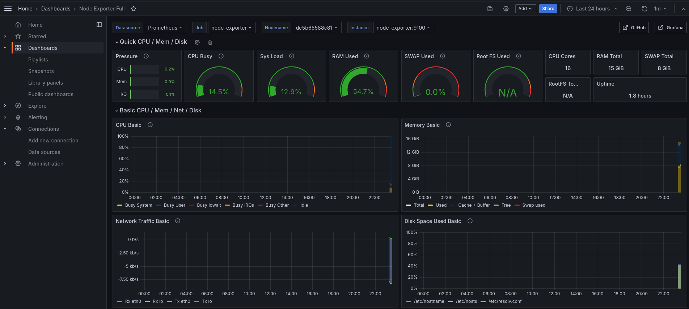
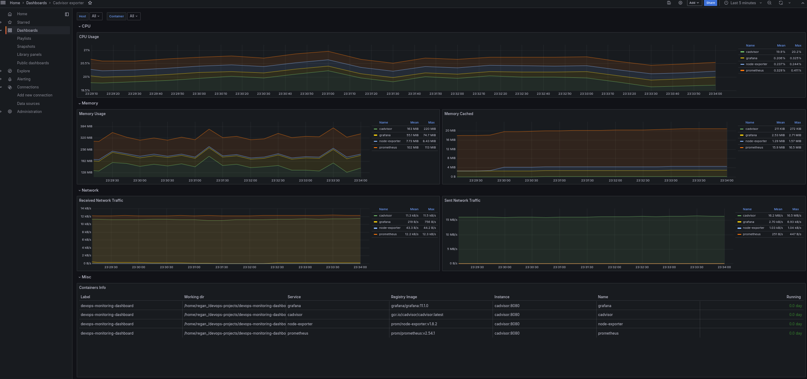
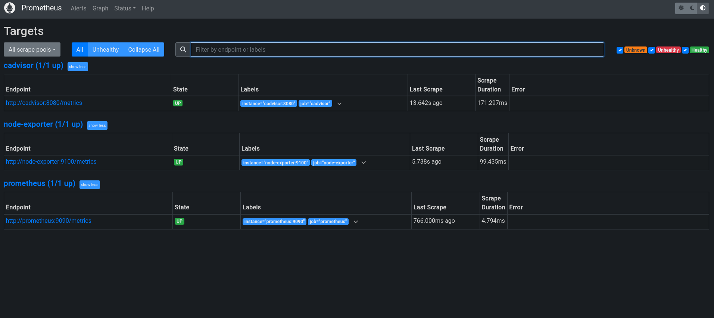
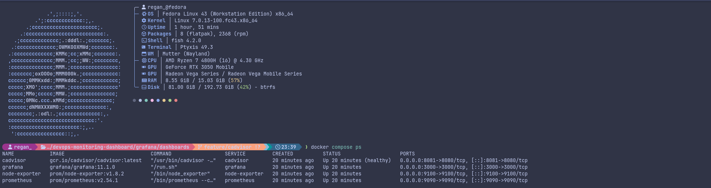

# DevOps Monitoring Dashboard

A production-style infrastructure monitoring stack — Prometheus, Grafana, Alertmanager, cAdvisor, and Node Exporter — built first with Docker Compose, then migrated to Kubernetes with RBAC, NetworkPolicies, and CI manifest validation.

> **v3.0** — Kubernetes phase: all five services deployed to a `monitoring` namespace with RBAC, PVCs, a default-deny NetworkPolicy, an Ingress, and `kubeconform`-validated manifests in CI.

This project is being built in public as part of a structured Cloud/DevOps engineering roadmap. Every stage is documented as it happens, including what's broken and what's still in progress — not just the finished result.

## Overview

The goal is a real-time observability stack that monitors both host-level and container-level metrics, deployable either as a single-node Docker Compose stack for local development or as a namespaced Kubernetes deployment with alerting, RBAC, and network segmentation.

**Current phase:** Docker Compose — complete. Kubernetes migration — core workloads, RBAC, and NetworkPolicy deployed; see [Known Limitations](#known-limitations) for what's intentionally deferred.

## Architecture

```
┌──────────────┐      ┌──────────────┐      ┌──────────────┐      ┌──────────────┐
│ Node Exporter│─────▶│              │      │              │      │              │
│ (host metrics│      │  Prometheus  │─────▶│ Alertmanager │      │   Grafana    │
├──────────────┤      │  (scrape +   │      │  (routes &   │      │ (dashboards) │
│   cAdvisor   │─────▶│   storage)   │      │   alerts)    │      │              │
│ (container   │      │              │      │              │      │              │
│  metrics)    │      └──────┬───────┘      └──────────────┘      └──────▲───────┘
└──────────────┘             └──────────────────────────────────────────┘
                                        queried by Grafana
```

* **Node Exporter** — DaemonSet exposing host-level metrics (CPU, memory, disk, network) on every node
* **cAdvisor** — exposes per-container resource usage; runs privileged with host `/rootfs`, `/sys`, and `/var/lib` mounts, which container-level introspection requires
* **Prometheus** — scrapes and stores metrics as time-series data; all scrape targets confirmed `UP` in both Docker and Kubernetes
* **Alertmanager** — receives alerts from Prometheus and handles routing (Kubernetes phase only)
* **Grafana** — visualizes metrics through two auto-provisioned dashboards, no manual import required

## Dashboards

| Dashboard | Source | Panels |
|---|---|---|
| **Node Exporter Full** | `grafana/dashboards/host-monitoring.json` | 31 panels — CPU, memory, disk, network, systemd, filesystem, and more |
| **cAdvisor Exporter** | `grafana/dashboards/container-dashboard.json` | 10 panels — per-container CPU, memory, network, and metadata |

### Screenshots

| Host Dashboard | Container Dashboard |
|---|---|
|  |  |

| Prometheus Targets | `docker compose ps` |
|---|---|
|  |  |

## Tech Stack

| Category | Tools |
|---|---|
| OS | Linux (Fedora) |
| Containerization | Docker, Docker Compose |
| Orchestration | Kubernetes (namespace, Deployments, DaemonSet, PVCs, Ingress) |
| Metrics & Monitoring | Prometheus v2.54.1, Node Exporter v1.8.2, cAdvisor v0.49.1, Alertmanager v0.27.0 |
| Visualization | Grafana 11.1.0 |
| Security | RBAC (ServiceAccount/ClusterRole/ClusterRoleBinding), default-deny NetworkPolicy |
| CI | GitHub Actions + `kubeconform` manifest validation |
| Version Control | Git, GitHub |

## Getting Started — Docker Compose

### Prerequisites

* Docker and Docker Compose installed
* Ports `9090`, `3000`, `9100`, and `8081` free on your host

### Setup

1. Clone the repository
   ```bash
   git clone https://github.com/ItzMeBeasT/devops-monitoring-dashboard.git
   cd devops-monitoring-dashboard
   ```

2. Create your environment file from the example
   ```bash
   cp .env.example .env
   ```
   Then edit `.env` and set your own Grafana admin credentials. This file is gitignored and never committed.

3. Start the stack
   ```bash
   docker compose up -d
   ```

4. Verify everything is healthy
   ```bash
   docker compose ps
   ```

### Access the services (Docker Compose)

| Service | URL | Notes |
|---|---|---|
| Grafana | http://localhost:3000 | Login with credentials from `.env`; dashboards are pre-loaded |
| Prometheus | http://localhost:9090 | Check **Status → Targets** to confirm all scrape jobs are `UP` |
| Node Exporter | http://localhost:9100/metrics | Raw host metrics |
| cAdvisor | http://localhost:8081 | Raw per-container metrics |

## Getting Started — Kubernetes

### Prerequisites

* A running cluster (tested with a local single-node cluster) and `kubectl` configured
* An `nginx` Ingress controller installed if you want to use the provided Ingress

### Deploy

```bash
kubectl apply -f kubernetes/namespace.yaml
kubectl apply -f kubernetes/rbac/
kubectl apply -f kubernetes/prometheus/
kubectl apply -f kubernetes/node-exporter/
kubectl apply -f kubernetes/cadvisor/
kubectl apply -f kubernetes/alertmanager/
kubectl apply -f kubernetes/grafana/
kubectl apply -f kubernetes/networkpolicy/
kubectl apply -f kubernetes/ingress/
```

Manifests are validated on every push/PR via `kubeconform -strict` (see `.github/workflows/`).

### Access the services (Kubernetes)

All services are exposed as `NodePort` for local testing, or via the included Ingress (`grafana.local`, `prometheus.local`, `alertmanager.local` — add these to `/etc/hosts` pointing at your cluster's ingress IP).

## Known Limitations

Documented deliberately rather than left for a reviewer to discover — these are scoped out for now to keep the project moving, not overlooked:

- **NetworkPolicy egress is Prometheus-only.** The `default-deny` policy blocks all ingress/egress in the `monitoring` namespace, but explicit egress rules are only written for Prometheus (→ Node Exporter, cAdvisor, Alertmanager). Grafana has no egress rule to reach Prometheus, and no pod has DNS egress (port 53) allowed. In a real deployment this would need to be filled in before Grafana could query its datasource — next up on the NetworkPolicy work.
- **Grafana admin credentials are hardcoded in `kubernetes/grafana/secret.yaml`** (`admin`/`admin`) for quick local testing, unlike the Docker Compose phase where they're externalized via `.env`. Not meant to reflect real secret-management practice — would move to a sealed secret or external secret store before any real use.
- **No resource requests/limits or liveness/readiness probes** on any Kubernetes workload yet.
- **`privileged: true` on cAdvisor** is required for container-level host introspection (`/rootfs`, `/sys`, `/var/lib` access) but doesn't yet have an inline comment explaining why.

## Project Structure

```
.
├── docker-compose.yml
├── .env.example
├── prometheus/
│   └── prometheus.yml          # scrape configs (prometheus, node-exporter, cadvisor)
├── grafana/
│   ├── provisioning/
│   │   ├── datasources/        # auto-provisioned Prometheus datasource
│   │   └── dashboards/         # dashboard provider config
│   └── dashboards/             # dashboard JSON files (host + container)
├── kubernetes/
│   ├── namespace.yaml
│   ├── rbac/                   # ServiceAccount, ClusterRole, ClusterRoleBinding
│   ├── prometheus/              # Deployment, Service, PVC
│   ├── grafana/                 # Deployment, Service, PVC, Secret
│   ├── alertmanager/            # Deployment, Service, config
│   ├── node-exporter/            # DaemonSet, Service
│   ├── cadvisor/                 # Deployment, Service
│   ├── networkpolicy/            # default-deny + Prometheus allow rules
│   └── ingress/                  # host-based Ingress for all UIs
├── .github/workflows/            # kubeconform CI validation
└── screenshots/                  # dashboard and stack verification screenshots
```

## Roadmap

- [x] Linux fundamentals and Git workflow
- [x] Prometheus + Node Exporter + Grafana via Docker Compose
- [x] Grafana credentials moved to `.env` (no hardcoded secrets, Docker phase)
- [x] Add cAdvisor for container-level metrics
- [x] Import/build Grafana dashboards for host + container metrics
- [x] Verify all Prometheus scrape targets are `UP`
- [x] Migrate stack to Kubernetes
- [x] Add Alertmanager for alerting rules
- [x] Apply RBAC and a default-deny NetworkPolicy baseline
- [x] Validate manifests in CI with `kubeconform`
- [ ] Complete NetworkPolicy egress rules (Grafana → Prometheus, DNS for all pods)
- [ ] Externalize Grafana admin credentials in Kubernetes (match Docker phase)
- [ ] Add resource requests/limits and liveness/readiness probes
- [ ] Helm chart packaging

## Project Status

✅ **Docker Compose phase complete.** 🟡 **Kubernetes phase: core stack deployed and CI-validated, NetworkPolicy and secrets hardening in progress** — see [Known Limitations](#known-limitations).

## License

MIT
